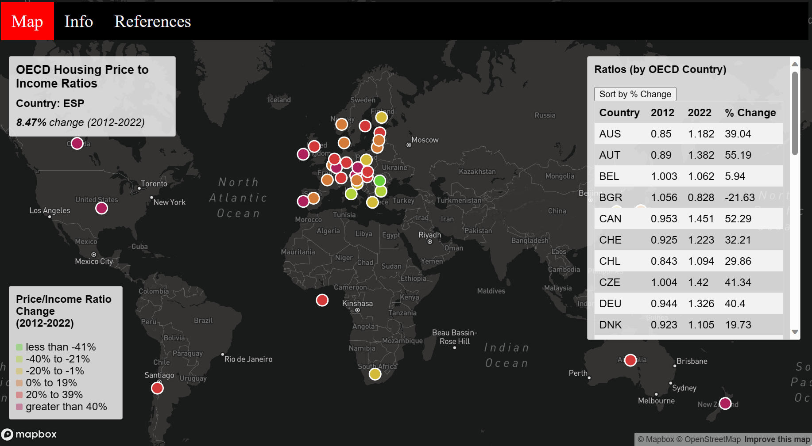

# OECD Housing Prices

[OECD Housing Prices Map](https://ilee17.github.io/geog328_group6_final/)

## Project Introduction
<<<<<<< HEAD
Over the past few years, with a rapidly rising housing market, it has seemed impossible for a
college student or almost anyone to afford a new house in the Seattle area. This, however, is not just a problem that’s seen here. We can also see this occurring in various states within the United States.For our final project, we decided to examine the change over the last 10 years in the ratio between income and housing costs throughout the world, specifically focusing on countries that are part of the OECD (Organisation forEconomic Co-operation and Development). Our goal is to create a useful tool for helping first-time homeowners withdeciding on a suitable economy to buy their first house. Based on the data from the Organisation for Economic Co-operation and Development (OECD) that tells the audience of each country's percentage change in housing price to income ratio from the years 2012 to 2022.
=======
Over the past few years, with a rapidly rising housing market, it has seemed impossible for a college student - or almost anyone - to afford a new house in the Seattle area. However, this is not a problem that can only be seen in Washington. We can also see this occurring in various states within the United States, as well as in other countries. For our final project, we decided to examine the change over the last 10 years of the ratio between income and housing costs throughout the world, specifically focusing on countries that are part of the OECD (Organisation for Economic Co-operation and Development). Our goal is to create a useful tool for helping first time homeowners with deciding on a suitable economy to buy their first house in.
>>>>>>> 21668b0ff67c6553285e00e2401b864ca5a2d98d

## Functions
The map has points located on each of the OECD countries across the world that you can hover over to see the each country's percent change in housing price to income ratio from 2012 to 2022. Specifically, this price to income ratio is the house price index divided by the nominal disposable income per person. This ratio is used to determine affordablity at a given point in time. We added a table on the right side with more extensive data for each of the countries, including the 2012 price to income ratio, the 2022 price to income ratio, and the percent change between these two values.Included with the table is a sort function that allows the user to sort the countries in the table by percent change, both ascending and descending. Shrinking the horizontal size of the window causes the table to disappear in order to preserve the functionality of the overall map.

## Limitations
A major limitation of this project is that the chosen dataset lacks data for any countries outside of the OECD, which means that while the majority of countries in Europe, North America, and Oceania are represented here, the majority of countries in South America, Africa, and Asia are not represented, with the four notable exceptions being Chile, South Africa, Japan, and South Korea.

## Conclusion
<<<<<<< HEAD
After mapping out the price-to-income ratio for 2012 and 2022, we found it interesting how the highest difference was in Luxembourg (LUX), with 70.42%. We also found it interesting that Romania (ROU) had a -41.62 % change between 2012 and 2022. This meant that instead of the ratio increasing, this country was able to close the gap between housing prices and income rates. A general overview of the map we can see that more countries had a higher difference between the income and housing cost ratio. Fewer countries have a ratio decreased which means fewer countries have the ability to close the gap between housing prices and income rates.
=======
After mapping out the price to income ratio for 2012 and 2022, we found it interesting how the largest percent change in a positive direction was in Luxembourg (LUX), with an increase of 70.42% between 2012 and 2020. We also found it interesting that Romania (ROU) had the largest percent change in a negative direction, at -41.62%, between 2012 and 2022. This meant that instead of the ratio increasing, Romania was able to successfully close the gap between housing prices and income rates.
>>>>>>> 21668b0ff67c6553285e00e2401b864ca5a2d98d

## Sources & Libraries & Web Services
The data we used was from the [Organisation for Economic Co-operation and Development](https://data.oecd.org/price/housing-prices.htm) 
The library we used was [Mapbox](https://docs.mapbox.com/mapbox-gl-js/guides/) 
The web services we used were [GitHub](https://github.com/) and [Mapbox](https://www.mapbox.com/)